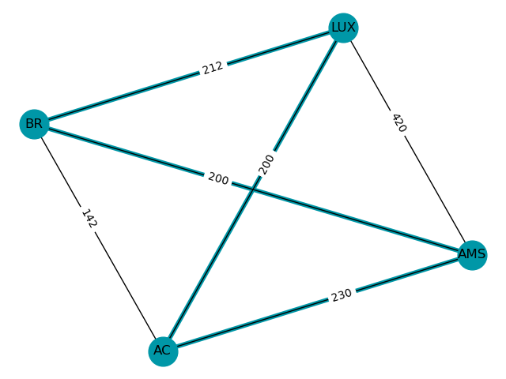

<a href="https://git.io/grapresso" target="_blank">
    
</a>
<a href="https://travis-ci.org/kdevo/grapresso" target="_blank">
    
</a>


---

Caffeinated object-oriented Python graph data structure library [originated from an academical context](#Development).
 
**Grapresso** ☕ is like a good espresso among other graph libs:

- **Quickly consumed**: Easy-to-learn and setup - [just try it](#Usage)!
- **Different flavours**: Suit up your [backend of choice](#Backends)
- **Beans are first class**: Object-oriented approach with nodes as first [*class citizens*](https://github.com/kdevo/grapresso/blob/master/grapresso/components/node.py#L7)
- **Make your Macchiato**: Extensible by design, e.g. [battle-tested by the new NetworkX backend implementation](#Implementations)
- **Concentrated**: [Clear and concise *algorithms*](https://github.com/kdevo/grapresso/blob/master/grapresso/components/graph.py#L117)
- **Well tested ingredients**: Stress-[integration-tested](https://github.com/kdevo/grapresso-it) using *huge* graphs
- **Clean and lightweight**: Written in pure *Python 3*, 
[no other libraries needed](https://github.com/kdevo/grapresso/blob/master/setup.py#L25) 

Grapresso works wonderfully with PyPy and is up to [up to 4x faster than your regular Python](https://travis-ci.org/github/kdevo/grapresso/builds/704782062). ⚡ 
 

> This project is in an early state. There are many popular algorithms that are **not** yet implemented (at least natively, read below) 
> Feel free to contribute! Make it feel like home for your own graph algorithms. 


## Goals 
### Grapresso vs. alternatives

There are many other good graph/network theory libraries. 
The most popular Python one is probably [NetworkX](https://networkx.github.io/).

From an algorithmic perspective, Grapresso will never be able to beat this extremely powerful library with a long history.
Instead, it follows a different philosophy and aims to be...
1. *Object-oriented* [instead of using dicts for everything]()
2. *Abstracted and modular* through separation of concerns
3. Finally, a powerful *meta library* to handle other libraries via backends 

> 💡 To fully demonstrate the power of abstraction, Grapresso can be used as a middleman for NetworkX.
> Therewith, you can utilize the full power of NetworkX in case an algorithm is not implemented in Grapresso.
 
## Usage

Install from PyPI, for instance via pip (needs Python >= 3.6):

```shell
pip install grapresso
```

Want to get the cheapest tour (round-trip) for [TSP](https://en.wikipedia.org/wiki/Travelling_salesman_problem)? Usage is easy:

```python
from grapresso import Graph

# Build a fully connected graph using InMemoryBackend (default if no backend is given):
graph = Graph() \
    .add_edge("Aachen", "Amsterdam", cost=230) \
    .add_edge("Amsterdam", "Brussels", cost=200) \
    .add_edge("Brussels", "Aachen", cost=142)

# Now also add Luxembourg - note that every city needs to be connected to it for the graph to stay fully connected:
for city, dist in zip(("Aachen", "Brussels", "Amsterdam"), (200, 212, 420)):
    graph.add_edge(city, "Luxembourg", cost=dist)

tour = graph.cheapest_tour("Aachen")
assert tour.cost == 842
print(tour)
```

Now, printing to console is not really visually appealing, is it?
Let's install a backend plugin 
[as an extra](https://setuptools.readthedocs.io/en/latest/setuptools.html#declaring-extras-optional-features-with-their-own-dependencies) 
that is also capable of drawing the graph:

```shell
pip install grapresso[backend-networkx]
```

Let's quickly draw our previous graph by first converting it to one that uses NetworkX in the background 
and then utilizing NetworkX's natural drawing capabilities:

```python
from grapresso.backends import NetworkXBackend

nx_graph = graph.copy_to(Graph(NetworkXBackend(directed=False)))
nx_graph.backend.quick_draw(
    # Map ISO codes to the nodes so that the text fits in the boundaries:
    labels={'Aachen': 'AC', 'Amsterdam': 'AMS', 'Brussels': 'BR', 'Luxembourg': 'LUX'},
    # Show cost as label:
    edge_label_selector='cost',
    # Mark edges that are actually in the tour
    mark_edges=tour.edges,
)
```

The resulting image:



See [tests directory](tests) for more examples and also have a look at the 
[integration tests](https://github.com/kdevo/grapresso-it/blob/master/tests/perf/test_algorithm_integration.py)!

## Architecture

Grapresso provides a clean API so that you can easily extend it to store the graph's structure in your preferred storage format.
Algorithms are implemented completely independent from the backend.

### Backends
Algorithms are performed on a so called "backend" which wraps the graph's internal data structure.

The API is defined in [backend/api.py](grapresso/backends/api.py). Therewith, backends can easily be added provided that they carefully implement the defined API.

#### Implementations
Implementation                                           | Type                                                  | Underlying data structure                                            | Plugin installation 
-------------------------------------------------------- | ----------------------------------------------------- | -------------------------------------------------------------------- | ------
[InMemoryBackend](/grapresso/backends/memory.py)          | In-Memory with Traits                                 | `{node_name: obj}` with obj containing edges                        | Built-in 
[NetworkXBackend](/grapresso/backends/networkx.py)        | [NetworkX](https://networkx.github.io/) compatible    | nx.DiGraph with custom NetworkXNode/-Edge                           | `pip install grapresso[backend-networkx]`

## Development

This project has been originated in the subject *Mathematical Methods for Computer Science* (translated from the German "Mathematische Methoden der Informatik", abbreviated **MMI**) 
in the study programme Information Systems Engineering (ISE) at the FH Aachen.

### Contributing

Contributions are welcome, as long as the three [goals](#Goals) are followed.

Otherwise, you can simply support this project by hitting the  button.
Thanks!